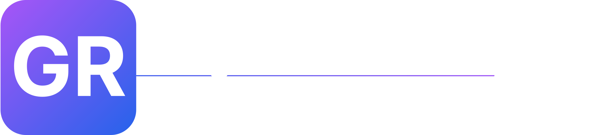
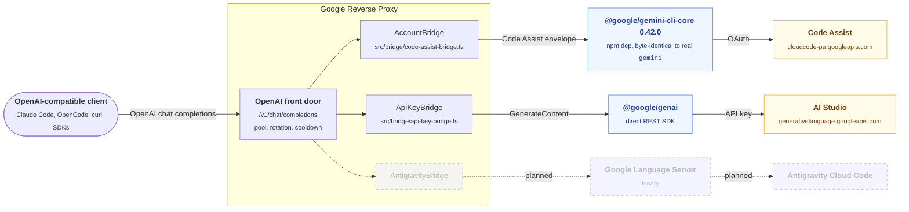
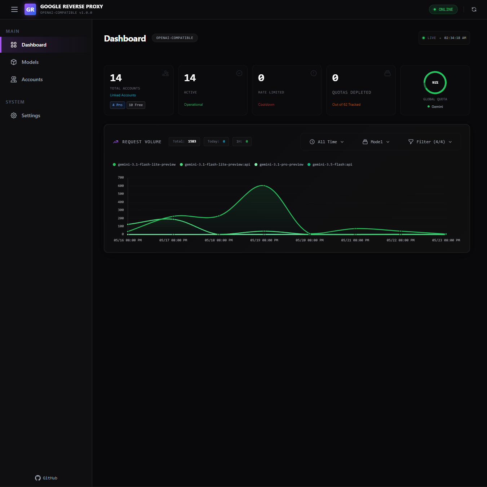
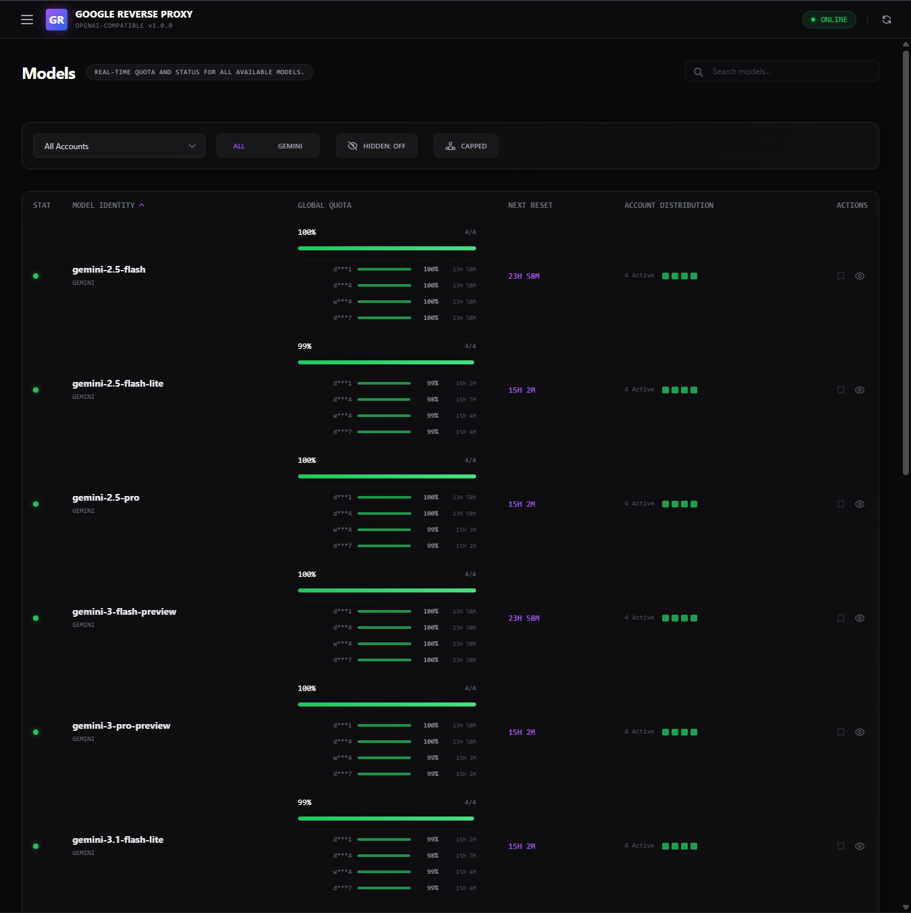

<div align="center">



An OpenAI-compatible reverse proxy for Google's AI products.
Pool many Google accounts behind one local OpenAI endpoint.
UI Repurposed from badrisnarayanan's [AntiGravity Proxy](https://github.com/badrisnarayanan/antigravity-claude-proxy).

[](LICENSE)
[](https://nodejs.org)
[](https://www.typescriptlang.org/)
[](https://hono.dev)
[](https://github.com/google-gemini/gemini-cli)
</div>

## What's supported

| Surface                                  | Status               | Backed by                                |
| :--------------------------------------- | :------------------- | :--------------------------------------- |
| Gemini CLI (Code Assist, personal OAuth) | Today                | `@google/gemini-cli-core@0.42.0` on npm  |
| Google AI Studio API keys                | Today, `:api` suffix | direct REST                              |
| Antigravity (Cloud Code)                 | Planned              |                                          |

*The Antigravity proxy will require mimicking user behaviour in the AG client with playwright, as Google has implemented extensive measures to detect third party usage, up to deep behavioral telemetry. If you download the AG client and inspect the outbound requests yourself, you will see what I am talking about. It's insane.*

## How it works



## Features

- Drop-in OpenAI API at `/v1/chat/completions` and `/v1/models`. Streaming, tool calls, vision, audio, video, PDF, JSON mode, reasoning effort.
- Account pool with `random`, `round-robin`, or `failover` rotation and configurable cooldown.
- Free-tier API key pool. Request any model with a `:api` suffix to route through pooled AI Studio keys. Exhausted keys cool down until Pacific midnight.
- Auto model-switching as a last-resort fallback when every account is rate-limited.
- Real Gemini thinking. Optionally stream `<thinking>` blocks inline DeepSeek-R1 style.
- Pinned upstream client. Bumps to `@google/gemini-cli-core` are explicit and re-verified against the parity golden.
- Built-in dashboard for accounts, per-model quota, request volume, model visibility, dashboard password.

## Quick start

```bash
./start.sh       # macOS, Linux
.\start.ps1      # Windows
```

The launcher installs a pinned Node 24, fetches dependencies, and serves `http://localhost:8787`. Open `/`, click **Add Account**, complete the Google OAuth flow.

Manual alternative:

```bash
npm install && npm start
```

## Screenshots

| Dashboard                                       | Model quota                                 |
| :---------------------------------------------- | :------------------------------------------ |
|   |     |

## Using it

Point any OpenAI-compatible client at `http://localhost:8787/v1`. Use the bearer token printed at startup or set `OPENAI_API_KEY` yourself.

```bash
export OPENAI_BASE_URL="http://localhost:8787/v1"
export OPENAI_API_KEY="<token from startup banner>"

curl "$OPENAI_BASE_URL/chat/completions" \
  -H "Authorization: Bearer $OPENAI_API_KEY" \
  -H "Content-Type: application/json" \
  -d '{
    "model": "gemini-3.1-pro-high",
    "messages": [{"role": "user", "content": "Hello!"}],
    "stream": true
  }'
```

### Picking an upstream per request

Each base model exposes three variants. The suffix decides which pool serves the request.

| Model id                                  | Routing                                                                                                |
| :---------------------------------------- | :----------------------------------------------------------------------------------------------------- |
| `gemini-3.1-pro-high`                     | Tries the preferred upstream first, falls back to the other when it is exhausted or has no accounts.   |
| `gemini-3.1-pro-high:cli`                 | Forces the Gemini CLI (Code Assist OAuth) pool. Never falls back to API keys.                          |
| `gemini-3.1-pro-high:api`                 | Forces the AI Studio API-key pool. Never falls back to OAuth.                                          |

The preferred upstream defaults to `cli` and can be changed in Settings or via `PREFERRED_ACCOUNT_KIND=api`.

```bash
curl "$OPENAI_BASE_URL/chat/completions" \
  -H "Authorization: Bearer $OPENAI_API_KEY" \
  -H "Content-Type: application/json" \
  -d '{"model": "gemini-3.1-flash-lite-preview:api", "messages": [...]}'
```

## Configuration

Set as env vars or persist via `~/.gemini-cli-openai/config.json`. On Windows: `%USERPROFILE%\.gemini-cli-openai\config.json`. Dashboard settings land in the same file. All optional unless noted.

### Identity and accounts

| Variable              | Default         | Purpose                                                                                          |
| :-------------------- | :-------------- | :----------------------------------------------------------------------------------------------- |
| `GCP_SERVICE_ACCOUNT` |                 | OAuth2 credentials JSON, one object or an array. Required unless using in-app login or API keys. |
| `GEMINI_API_KEYS`     |                 | AI Studio API keys, JSON array or comma/space/newline list. Used only for `:api` models.         |
| `GEMINI_PROJECT_ID`   | auto-discovered | Pin a Google Cloud project for the Code Assist bridge. Honored only with a single OAuth account. |

### Server

| Variable                 | Default                                                          | Purpose                                                                                                |
| :----------------------- | :--------------------------------------------------------------- | :----------------------------------------------------------------------------------------------------- |
| `OPENAI_API_KEY`         | auto-generated                                                   | Bearer token required on `/v1/*`. Generated `sk-...` value persists to `config.json`.                  |
| `PORT`                   | `8787`                                                           | HTTP listen port.                                                                                      |
| `HOST`                   | `0.0.0.0`                                                        | HTTP bind address.                                                                                     |
| `GEMINI_CLI_OPENAI_HOME` | `~/.gemini-cli-openai`                                           | State directory for tokens, settings, metrics, dashboard password.                                     |
| `CORS_ALLOWED_ORIGINS`   | `localhost, 127.0.0.1,[::1] + :8787`  | Comma-separated origins or `*`. Wildcard is risky when no dashboard password is set.                   |

### Account pool

| Variable                      | Default  | Purpose                                                                                              |
| :---------------------------- | :------- | :--------------------------------------------------------------------------------------------------- |
| `ACCOUNT_SELECTION_STRATEGY`  | `random` | One of `random`, `round-robin`, `failover`.                                                          |
| `ACCOUNT_COOLDOWN_SECONDS`    | `90`     | Skip duration after a rate-limited account.                                                          |
| `PREFERRED_ACCOUNT_KIND`      | `cli`    | Which upstream to try first for bare model names. `cli` or `api`. Dashboard setting overrides this.  |
| `ENABLE_AUTO_MODEL_SWITCHING` | `false`  | When every account is rate-limited, downgrade `3.1-pro` to `3-flash` to `2.5-pro` to `2.5-flash`.    |

### Reasoning and thinking

| Variable                     | Default  | Purpose                                                                              |
| :--------------------------- | :------- | :----------------------------------------------------------------------------------- |
| `ENABLE_REAL_THINKING`       | `false`  | Ask Gemini for step-by-step reasoning. Slightly slower, richer output.               |
| `STREAM_THINKING_AS_CONTENT` | `false`  | Stream reasoning inline as `<thinking>` blocks DeepSeek-R1 style.                    |

### Native Google tools

| Variable                     | Default | Purpose                                                                                 |
| :--------------------------- | :------ | :-------------------------------------------------------------------------------------- |
| `ENABLE_GEMINI_NATIVE_TOOLS` | `false` | Master switch for Gemini's built-in tool set.                                           |
| `ENABLE_GOOGLE_SEARCH`       | `false` | Permit the Google Search grounding tool. Requires `ENABLE_GEMINI_NATIVE_TOOLS`.         |
| `ENABLE_URL_CONTEXT`         | `false` | Permit Gemini to fetch URLs as context. Requires `ENABLE_GEMINI_NATIVE_TOOLS`.          |
| `GEMINI_TOOLS_PRIORITY`      | `mixed` | Conflict resolution between client tools and native tools. `native`, `custom`, `mixed`. |
| `DEFAULT_TO_NATIVE_TOOLS`    | `true`  | Use native tools when the client doesn't choose.                                        |
| `ALLOW_REQUEST_TOOL_CONTROL` | `true`  | Allow per-request `extra_body.native_tools_priority` to override the env default.       |

### Citations and grounding metadata

| Variable                     | Default  | Purpose                                                                              |
| :--------------------------- | :------- | :----------------------------------------------------------------------------------- |
| `ENABLE_INLINE_CITATIONS`    | `false`  | Inline `[n]` markers into response text for each grounded citation.                  |
| `INCLUDE_GROUNDING_METADATA` | `true`   | Attach Gemini's full grounding metadata to streaming chunks.                         |
| `INCLUDE_SEARCH_ENTRY_POINT` | `false`  | Include the search-suggestion entry-point block.                                     |

### Safety thresholds

Each accepts `OFF`, `BLOCK_NONE`, `BLOCK_FEW`, `BLOCK_SOME`, `BLOCK_ONLY_HIGH`, `HARM_BLOCK_THRESHOLD_UNSPECIFIED`. Unset means Google's default.

| Variable                                            |
| :-------------------------------------------------- |
| `GEMINI_MODERATION_HARASSMENT_THRESHOLD`            |
| `GEMINI_MODERATION_HATE_SPEECH_THRESHOLD`           |
| `GEMINI_MODERATION_SEXUALLY_EXPLICIT_THRESHOLD`     |
| `GEMINI_MODERATION_DANGEROUS_CONTENT_THRESHOLD`     |

### Upstream overrides (advanced)

| Variable                | Default                                     | Purpose                                                           |
| :---------------------- | :------------------------------------------ | :---------------------------------------------------------------- |
| `GEMINI_API_BASE_URL`   | `https://generativelanguage.googleapis.com` | Override the AI Studio REST host.                                 |
| `GEMINI_CLI_PROXY`      |                                             | HTTP/HTTPS proxy URL for the Code Assist bridge.                  |
| `GEMINI_CLI_USER_AGENT` | matches real CLI                            | Override the User-Agent sent to Google. Breaks parity if changed. |
| `GOOG_API_CLIENT`       | matches real CLI                            | Override the `x-goog-api-client` header. Same parity caveat.      |

### Logging

| Variable     | Default  | Purpose                                                                              |
| :----------- | :------- | :----------------------------------------------------------------------------------- |
| `DEBUG_LOGS` | `false`  | Verbose request/response logging. Risk of token leakage. Do not run in production.   |
| `LOG_LEVEL`  | `info`   | Alternate way to enable debug.                                                       |
| `NO_COLOR`   | unset    | Disable ANSI colors. Also respected via no-TTY detection.                            |

## Parity

`npm test` runs a zero-egress golden diff against a captured real-client baseline of the on-the-wire `streamGenerateContent` envelope and headers. Run on Node 24 for byte-identical output. New CLI versions go through this test before shipping.

## Roadmap

- Antigravity (Cloud Code) as a third bridge alongside Gemini CLI and AI Studio.
- More Google AI surfaces as they ship public endpoints.

## Support

<a href="https://ko-fi.com/mousedev"></a>

## Credits

- Frontend (dashboard, account UI, models view, charts, theme) derives heavily from [badri-s2001/antigravity-claude-proxy][acp]. The Alpine + Tailwind + DaisyUI shell, the dashboard layout, and the modal patterns started there.
- Upstream Google client [`@google/gemini-cli-core`][gcc] (Apache-2.0), pulled from npm at the exact pinned version.
- Multi-account pooling pattern inspired by [opencode-antigravity-auth][oag] via the antigravity-proxy line of work.

[acp]: https://github.com/badri-s2001/antigravity-claude-proxy
[gcc]: https://github.com/google-gemini/gemini-cli
[oag]: https://github.com/NoeFabris/opencode-antigravity-auth

## License

MIT, see [LICENSE](LICENSE). The upstream `@google/gemini-cli-core` dependency is licensed separately under Apache-2.0.

<p align="right">(<a href="#readme-top">back to top</a>)</p>
